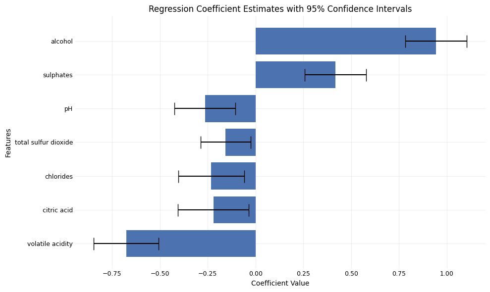

# Modeling Wine Quality: Analyzing Physicochemical Variable Influences

## Dataset

The dataset for this project can be found on [Kaggle](https://www.kaggle.com/datasets/uciml/red-wine-quality-cortez-et-al-2009) (licensed under DbCL).

This dataset comprises information on Vinho Verde, a type of wine from Portugal, specifically focusing on the red variants, collected between May 2004 and February 2007. The dataset includes samples tested by the official certification entity (CVRVV), an organization dedicated to enhancing the quality and marketing of Vinho Verde. Each row represents a unique wine sample, with results from physicochemical tests and sensory evaluations by at least three assessors. The final sensory score is the median of these evaluations.

The data was collected by the researchers who published an [article](https://archive.ics.uci.edu/dataset/186/wine+quality). However, they did not specify whether the sampling method was random. For the purposes of this project, I will assume it is random to apply statistical inference methods.

Explanations of physicochemical variables:
- Fixed acidity: Contributes to the wine's tartness and freshness.
- Volatile acidity: At high levels, it can cause an unpleasant vinegar taste.
- Citric acid: Adds a fresh, citrus-like flavor to the wine.
- Residual sugar: Affects the sweetness of the wine.
- Chlorides: Influences the wine's overall flavor and can add a salty taste.
- Free sulfur dioxide: Acts as a preservative, protecting the wine from oxidation and spoilage.
- Total sulfur dioxide: Combined with free sulfur dioxide, it preserves the wine and prevents spoilage.
- Density: Affects the mouthfeel and weight of the wine.
- pH: Measures the wine's acidity; lower pH wines are more acidic and crisp.
- Sulphates: Preserves the wine and prevents microbial growth, can affect the flavor and stability.
- Alcohol: Contributes to the wine's warmth and richness.

## Objectives

The main objective of this project is:

> **Describe the relationship between physicochemical factors and the quality of red Vinho Verde wine.**
 
This could be a first step for further studies aimed at finding causation between positively and negatively linked factors with wine quality, ultimately leading to the production of higher quality wines.

To achieve this objective, it was further broken down into the following three sub-objectives:

1. Conduct data cleaning and exploratory data analysis to identify and address data quality issues.
2. Apply and refine the fit of the ordinal logistic regression model.
3. Report the associations between each variable and wine quality based on the regression coefficients.

## Insights

Findings from the regression analysis of wine quality:

1. Largest positive influence: alcohol.
2. Positive influence: sulphites.
3. Negative influence and not possible to say which is larger: pH, total sulfur dioxide, chlorides, and citric acid.
4. Largest negative influence: volatile acidity.
5. No statistically significant influence: density, residual sugar, free sulfur dioxide, and fixed acidity.
6. Fixed acidity doesn't add unique value. Other features collectively contain similar information.

*These associations are reliable only within the analyzed data ranges.*

